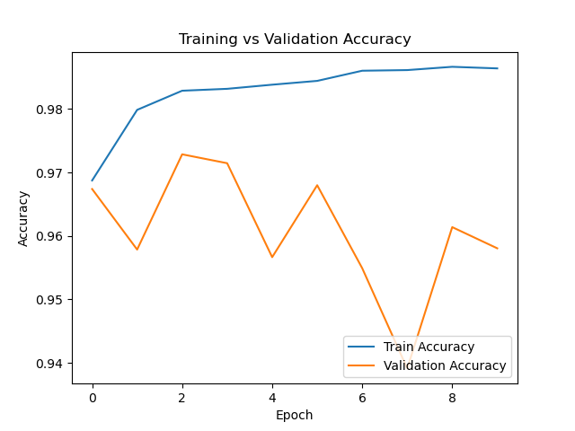
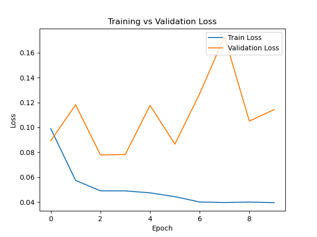

# 🌾 GrainPalette – A Deep Learning Odyssey in Rice Type Classification


GrainPalette is a deep learning-based web application that classifies rice grains into five distinct types using transfer learning with MobileNetV2. Built using Flask, it empowers farmers and researchers to identify rice varieties easily using just an image.

---

## 📂 Dataset

- **Kaggle Dataset:** [Rice Image Dataset by Murat Köklü](https://www.kaggle.com/datasets/muratkokludataset/rice-image-dataset)
- **Classes:** Arborio, Basmati, Ipsala, Jasmine, Karacadag

---

## 🧠 Model Architecture

- Transfer Learning with **MobileNetV2**
- Image Size: 224x224
- Optimizer: Adam
- Loss: Categorical Crossentropy
- Trained for 10 epochs on ~74% train, ~26% validation split

---

## 📊 Model Performance

### ✅ Accuracy Plot


### ❌ Loss Plot


---

## 📥 Download Pre-trained Model

> **Note:** GitHub limits file size to 100MB.  
> Download the trained model (`rice_model.h5`) from:

📦 [Download rice_model.h5 (Google Drive)](https://drive.google.com/file/d/1r07Z-ClwSn3gmBgrT5jSXUjuGxS-1EOO/view?usp=sharing)

---

## 📽️ Demo

🎥 **Video Preview:**  
_A short demonstration is available in the "Video Demo" folder._

---

## 🚀 How to Run Locally

1. Clone the repository:
   ```bash
   git clone https://github.com/YourUsername/GrainPalette.git
   cd GrainPalette
   ```

2. Install dependencies:
   ```bash
   pip install -r requirements.txt
   ```

3. Run the Flask app:
   ```bash
   python app.py
   ```

4. Open your browser at `http://localhost:5000`

---

## 🖼️ Example Prediction

- Upload a rice grain image.
- The model classifies it into one of the 5 trained categories.

---

## 📁 Project Structure

```
GrainPalette/
├── app.py
├── rice_model.h5
├── static/
├── templates/
│   ├── index.html
│   ├── result.html
|   ├── details.html
├── dataset/
│   ├── Train/
│   └── Validation/
├── accuracy_plot.png
├── loss_plot.png
├── README.md
```

---

## ✨ Credits

- **Project Author:** Harika Devi
- **Model Trainer & UI Designer:** Deepak
- **Banner Design:** GitHub user [Deepak3460](https://github.com/Deepak3460)
- **Dataset Source:** [Murat Köklü – Kaggle](https://www.kaggle.com/datasets/muratkokludataset/rice-image-dataset)

---

## 📌 License

This project is open-source and available under the [MIT License](LICENSE).
